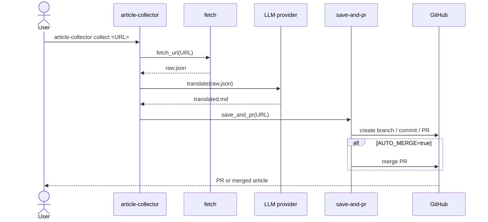

# article-collector

URL -> 記事取得 -> 翻訳 -> PR 作成を自動化する Rust 製 CLI ツール。

任意の OpenAI 互換 API / Anthropic API / Claude Code CLI で翻訳できる。

## セットアップ

### 推奨: GitHub Releases から取得

Release workflow により作成された latest release のビルド済みバイナリを利用する。
Rust toolchain は不要。

| Platform | Asset |
|----------|-------|
| Linux amd64 | `article-collector-linux-amd64` |
| Linux arm64 | `article-collector-linux-arm64` |
| Windows amd64 | `article-collector-windows-amd64.exe` |
| macOS amd64 (Intel) | `article-collector-macos-amd64` |
| macOS arm64 (Apple Silicon) | `article-collector-macos-arm64` |

```bash
# Linux / macOS
ASSET=article-collector-linux-amd64
curl -L -o article-collector "https://github.com/rurusasu/article-collector/releases/latest/download/${ASSET}"
chmod +x article-collector
mkdir -p "$HOME/.local/bin"
mv article-collector "$HOME/.local/bin/article-collector"
```

```powershell
# Windows PowerShell
$asset = "article-collector-windows-amd64.exe"
$binDir = "$env:USERPROFILE\bin"
New-Item -ItemType Directory -Force $binDir | Out-Null
Invoke-WebRequest `
  -Uri "https://github.com/rurusasu/article-collector/releases/latest/download/$asset" `
  -OutFile "$binDir\article-collector.exe"
```

### 代替: cargo install

Rust toolchain / Cargo が入っている環境では、source から直接インストールできる。
Release asset が使えない環境での fallback としても使える。

```bash
cargo install --git https://github.com/rurusasu/article-collector --locked
```

Windows で `cargo` が未導入の場合は、先に Rust を入れる:

```powershell
winget install Rustlang.Rustup
```

新しい PowerShell を開き直してから、上の `cargo install` を実行する。

## 処理フロー

`article-collector collect <URL>` の全体フロー:



## クイックスタート

fetch のみなら翻訳 API や GitHub 認証なしで試せる。

```bash
article-collector fetch https://news.ycombinator.com/item?id=42575537
```

全工程を実行する場合:

```bash
export LLM_API_URL="https://api.openai.com/v1"
export LLM_API_TOKEN="sk-..."
export TARGET_REPO="your-org/your-repo"

article-collector collect https://news.ycombinator.com/item?id=42575537
```

Claude Code CLI を個人のローカル環境で使う場合:

```bash
export LLM_API_URL="claude-code"
article-collector collect https://example.com/article
```

## コマンド一覧

| コマンド | 役割 | 主な出力 / 副作用 |
|----------|------|-------------------|
| `article-collector collect <URL>` | 取得、翻訳、保存、PR 作成をまとめて実行 | `raw.json` / `translated.md` を作成し、保存先 repo に PR を作成 |
| `article-collector fetch <URL>` | URL から記事本文を取得 | `raw.json` を作成 |
| `article-collector translate [INPUT_JSON]` | 取得済み JSON を翻訳。省略時は作業ディレクトリの `raw.json` を読む | `translated.md` を作成 |
| `article-collector save-and-pr <URL>` | 翻訳済み Markdown を保存して PR を作成 | 保存先 repo に branch / commit / PR を作成 |

## 作業ディレクトリ

取得結果と翻訳結果は作業ディレクトリに保存される。

| OS | Default |
|----|---------|
| Linux / macOS / Git Bash / WSL | `/tmp/collect` |
| Windows native | `%TEMP%\article-collector` |

任意の場所に変えたい場合:

```bash
export ARTICLE_COLLECTOR_OUTDIR="$HOME/.cache/article-collector"
```

```powershell
$env:ARTICLE_COLLECTOR_OUTDIR = "$env:TEMP\article-collector"
```

出力ファイル:

| File | 内容 |
|------|------|
| `raw.json` | `fetch` の取得結果 |
| `translated.md` | `translate` の翻訳結果 |

## 設定

| Variable | Required | Default | Description |
|----------|----------|---------|-------------|
| `ARTICLE_COLLECTOR_OUTDIR` | No | OS 依存 | `raw.json` / `translated.md` の保存先 |
| `LLM_API_URL` | No | `claude-code` | API エンドポイント。`claude-code` で Claude Code CLI (`claude -p`) 使用 |
| `LLM_API_TOKEN` | Yes* | - | API 認証トークン |
| `LLM_MODEL` | No | provider 依存 | 翻訳に使うモデル |
| `TRANSLATE_LANG` | No | `ja` | 翻訳先言語コード |
| `TARGET_REPO` | Yes** | - | 保存先 GitHub リポジトリ (`owner/repo`) |
| `TARGET_DIR` | No | OS 依存 | 保存先 repo のローカル clone 先 |
| `SAVE_PATH_TEMPLATE` | No | `articles/${TYPE}/` | 保存先パステンプレート |
| `AUTO_MERGE` | No | `true` | PR 作成後に merge する |

\* `LLM_API_URL=claude-code` の場合は不要。
\*\* `save-and-pr` / `collect` の保存ステップのみ必要。

### Claude Code CLI 利用時の注意

翻訳そのものは Claude の一般用途として扱われているが、`LLM_API_URL=claude-code` は非対話の `claude -p` 実行になる。
Claude subscription plan で使う場合、2026-06-15 以降は Agent SDK monthly credit の対象になる。
credit を超えると、usage credits が有効なら標準 API rate で継続し、無効なら credit 更新まで停止する。

個人のローカル実行や開発補助には使えるが、第三者ユーザーのリクエストを Free / Pro / Max plan の認証情報へ流す用途には使わない。
共有サービス、本番バッチ、チームでの継続的な自動化では、Anthropic API key または対応 cloud provider を使う:

```bash
export LLM_API_URL="https://api.anthropic.com"
export LLM_API_TOKEN="sk-ant-..."
```

参考:

- [Claude Code legal and compliance](https://code.claude.com/docs/en/legal-and-compliance)
- [Use the Claude Agent SDK with your Claude plan](https://support.claude.com/en/articles/15036540-use-the-claude-agent-sdk-with-your-claude-plan)

`save-and-pr` は `gh` CLI を使うため、事前に認証が必要:

```bash
gh auth login
```

## 対応サイト

| Domain | Method | Auth |
|--------|--------|------|
| HackerNews | Firebase public API | None |
| Dev.to | Dev.to public API | None |
| YouTube | oEmbed + caption fetch | None |
| X/Twitter | Syndication API | Public tweets only |
| Other | HTTP fetch + HTML scraping | None |

## 開発

```bash
cargo fmt --check
cargo clippy --all-targets -- -D warnings
cargo test --locked
cargo build --release --locked
```

Taskfile は Rust CLI の薄いラッパーとして使える:

```bash
task fetch URL=https://example.com/article
task translate
task check
```

## リリース

`main` 宛の PR が merge されると `.github/workflows/release.yml` が実行される。
通常の PR merge では release-please が Release PR を作成・更新し、Release PR が merge されると GitHub Release と各 OS 向け asset が作成される。

詳細: [docs/ci-cd/README.md](docs/ci-cd/README.md)

## トラブルシューティング

### `cargo` が見つからない

Rust toolchain をインストールしてから、新しい shell を開き直す。

```bash
curl --proto '=https' --tlsv1.2 -sSf https://sh.rustup.rs | sh
source "$HOME/.cargo/env"
```

### リリースのダウンロードが失敗する

asset 名が platform と一致しているか、latest release に対象 asset があるかを確認する。
急ぐ場合や対象 platform の asset がない場合は、`cargo install --git https://github.com/rurusasu/article-collector --locked` を使う。

### `gh article-collector` として使いたい

現在の構成は通常の CLI (`article-collector`) 用。
GitHub CLI extension として `gh article-collector ...` で使うには、別途 `gh-article-collector` 名の実行ファイルまたは GitHub CLI extension 用の repo 構成が必要。

## ライセンス

MIT
