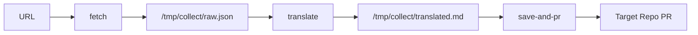
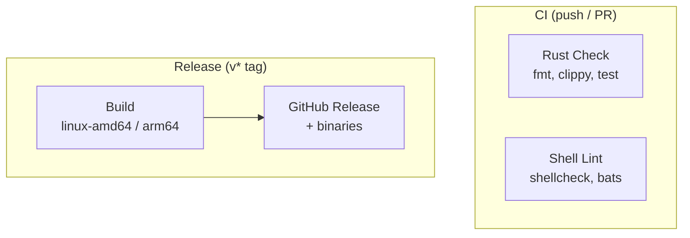

# article-collector

URL → 記事取得 → 翻訳 → PR 作成を自動化する Rust 製 CLI ツール。

任意の OpenAI 互換 API / Anthropic API / Claude Code で翻訳。go-task またはバイナリ直接実行で動作。

## セットアップ

### 前提条件

| Tool | Version | 用途 |
|------|---------|------|
| Rust | stable | ビルドに必要 |
| git | 2.0+ | リポジトリ操作 |
| gh | 2.0+ | GitHub CLI（`save-and-pr` で使用） |

### Windows

> **注意**: 本ツールは一時ファイルの保存に `/tmp/collect` を使用します。Windows ではネイティブのコマンドプロンプトではなく、**Git Bash** または **WSL** 経由で実行してください。

#### 方法 1: GitHub Releases からダウンロード（推奨）

```bash
# Git Bash で実行
gh release download --repo rurusasu/article-collector --pattern "article-collector-windows-amd64.exe"
mkdir -p ~/bin
mv article-collector-windows-amd64.exe ~/bin/article-collector.exe
```

#### 方法 2: ソースからビルド

```bash
# 1. Rust をインストール（未導入の場合）
# https://rustup.rs/ からインストーラをダウンロードして実行
# Visual Studio Build Tools の "C++ build tools" ワークロードも必要

# 2. GitHub CLI をインストール（save-and-pr を使う場合）
winget install GitHub.cli

# 3. リポジトリをクローンしてビルド
git clone https://github.com/rurusasu/article-collector.git
cd article-collector
cargo build --release

# 4. バイナリを PATH の通った場所にコピー（任意）
cp target/release/article-collector.exe ~/bin/article-collector
```

#### 方法 3: WSL (Windows Subsystem for Linux)

```bash
# WSL 内で Linux と同じ手順でセットアップ（下記「Linux」参照）
wsl
curl --proto '=https' --tlsv1.2 -sSf https://sh.rustup.rs | sh
source ~/.cargo/env
git clone https://github.com/rurusasu/article-collector.git
cd article-collector
cargo build --release
```

### macOS

```bash
# 1. Rust をインストール
curl --proto '=https' --tlsv1.2 -sSf https://sh.rustup.rs | sh
source ~/.cargo/env

# 2. GitHub CLI をインストール（save-and-pr を使う場合）
# Homebrew が必要: https://brew.sh
brew install gh

# 3. リポジトリをクローンしてビルド
git clone https://github.com/rurusasu/article-collector.git
cd article-collector
cargo build --release

# 4. バイナリを PATH の通った場所にコピー（任意）
cp target/release/article-collector ~/.local/bin/
```

### Linux

```bash
# 1. Rust をインストール
curl --proto '=https' --tlsv1.2 -sSf https://sh.rustup.rs | sh
source ~/.cargo/env

# 2. GitHub CLI をインストール（save-and-pr を使う場合）
# Ubuntu/Debian:
sudo apt install gh
# Fedora:
sudo dnf install gh
# Arch:
sudo pacman -S github-cli

# 3. リポジトリをクローンしてビルド
git clone https://github.com/rurusasu/article-collector.git
cd article-collector
cargo build --release

# 4. バイナリを PATH の通った場所にコピー（任意）
cp target/release/article-collector ~/.local/bin/
```

#### GitHub Releases からバイナリを直接取得

各プラットフォーム向けのビルド済みバイナリが GitHub Releases で提供されています。

| Platform | Asset |
|----------|-------|
| Linux amd64 | `article-collector-linux-amd64` |
| Linux arm64 | `article-collector-linux-arm64` |
| Windows amd64 | `article-collector-windows-amd64.exe` |
| macOS amd64 (Intel) | `article-collector-macos-amd64` |
| macOS arm64 (Apple Silicon) | `article-collector-macos-arm64` |

```bash
# Linux / macOS
gh release download --repo rurusasu/article-collector --pattern "article-collector-linux-amd64"
chmod +x article-collector-linux-amd64
mv article-collector-linux-amd64 ~/.local/bin/article-collector

# Windows (PowerShell)
gh release download --repo rurusasu/article-collector --pattern "article-collector-windows-amd64.exe"
Move-Item article-collector-windows-amd64.exe "$env:USERPROFILE\bin\article-collector.exe"
```

## Quick Start

```bash
# 環境変数を設定
export LLM_API_URL="https://api.openai.com/v1"
export LLM_API_TOKEN="sk-..."
export TARGET_REPO="your-org/your-repo"

# 記事を収集（取得 → 翻訳 → PR 作成まで一括実行）
article-collector collect https://news.ycombinator.com/item?id=42575537
```

fetch のみ（翻訳・PR なし）で試す場合:

```bash
article-collector fetch https://news.ycombinator.com/item?id=42575537
# 結果: /tmp/collect/raw.json に保存される
```

### go-task（レガシーシェルスクリプト）

```bash
pip3 install youtube-transcript-api
task collect URL=https://news.ycombinator.com/item?id=42575537
```

go-task の追加依存:

| Tool | Version | Install |
|------|---------|---------|
| bash | 4+ | OS built-in |
| curl | any | OS built-in |
| jq | 1.6+ | `apt install jq` / `brew install jq` |
| python3 | 3.8+ | OS built-in |
| youtube-transcript-api | latest | `pip3 install youtube-transcript-api` |
| go-task | 3.0+ | https://taskfile.dev/installation/ |

## CLI Usage

```bash
# 全工程 (取得 → 翻訳 → 保存 → PR)
article-collector collect <URL>

# 個別ステップ
article-collector fetch <URL>           # URL から記事を取得 → /tmp/collect/raw.json
article-collector translate [INPUT_JSON] # JSON を翻訳 → /tmp/collect/translated.md
article-collector save-and-pr <URL>      # 翻訳結果をターゲットリポジトリに PR
```

## Configuration

| Variable | Required | Default | Description |
|----------|----------|---------|-------------|
| `LLM_API_URL` | Yes | — | API エンドポイント (`claude-code` で Claude Code CLI 使用) |
| `LLM_API_TOKEN` | Yes* | — | API 認証トークン |
| `LLM_MODEL` | No | provider依存 | 翻訳に使うモデル |
| `TRANSLATE_LANG` | No | `ja` | 翻訳先言語コード |
| `TARGET_REPO` | Yes** | — | 保存先 GitHub リポジトリ (owner/repo) |
| `TARGET_DIR` | No | `/tmp/target-repo` | ローカルクローン先 |
| `SAVE_PATH_TEMPLATE` | No | `articles/${TYPE}/` | 保存先パステンプレート |
| `AUTO_MERGE` | No | `true` | PR 作成後に auto-merge |
| `GITHUB_TOKEN` | Yes** | — | GitHub API 認証 |

\* `LLM_API_URL=claude-code` の場合は不要
\*\* `save-and-pr` ステップのみ必要

### LLM プロバイダー設定例

```bash
# Claude Code (ローカル CLI)
export LLM_API_URL="claude-code"

# Anthropic API
export LLM_API_URL="https://api.anthropic.com/v1"
export LLM_API_TOKEN="sk-ant-..."

# OpenAI API
export LLM_API_URL="https://api.openai.com/v1"
export LLM_API_TOKEN="sk-..."
```

## Supported Sites

| Domain | Method | Auth |
|--------|--------|------|
| HackerNews | Firebase public API | None |
| Dev.to | Dev.to public API | None |
| YouTube | oEmbed + caption API | None |
| X/Twitter | Syndication API | Public tweets only |
| Other | HTTP fetch + HTML scraping | None |

## Pipeline Flow



## CI/CD



詳細: [docs/ci-cd/README.md](docs/ci-cd/README.md)

## Testing

```bash
# Rust
cargo test              # ユニットテスト (56 tests)
cargo clippy            # lint
cargo fmt --check       # フォーマット

# Shell (レガシー)
task lint               # shellcheck
task test               # bats
```

## Development

### devcontainer

VS Code / GitHub Codespaces の devcontainer 対応済み。Rust toolchain, gh CLI, go-task 等が自動セットアップされる。

```bash
# devcontainer 起動後
gh auth login
.github/setup-git.sh
```

### Project Management

- Issue tracking: [Linear (ArticleCollector)](https://linear.app/life-style-base/project/articlecollector-5d3a0da1c15c)
- ガイド: [docs/linear/README.md](docs/linear/README.md), [docs/pr/README.md](docs/pr/README.md)

## Troubleshooting

### Windows: `/tmp/collect` が見つからない

本ツールは一時ディレクトリとして `/tmp/collect` を使用します。ネイティブの Windows コマンドプロンプトや PowerShell では `/tmp` が存在しないため、以下のいずれかで実行してください:

- **Git Bash**: MSYS2 レイヤーにより `/tmp` パスが利用可能です
- **WSL**: Linux と同じパスが使えます

### `gh auth login` が必要

`save-and-pr` サブコマンドは `gh` CLI を使って PR を作成します。初回は認証が必要です:

```bash
gh auth login
```

### Claude Code で翻訳する場合

`LLM_API_URL=claude-code` を設定すると、ローカルにインストールされた Claude Code CLI (`claude -p`) を呼び出して翻訳します。事前に Claude Code がインストール・認証済みであることを確認してください。

## License

MIT
