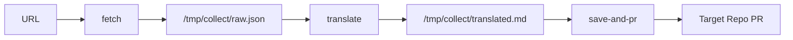
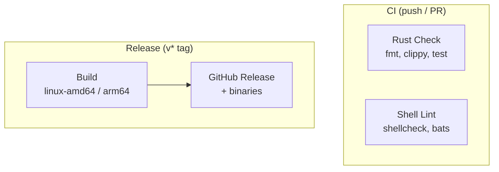

# article-collector

URL → 記事取得 → 翻訳 → PR 作成を自動化する Rust 製 CLI ツール。

任意の OpenAI 互換 API / Anthropic API / Claude Code で翻訳。go-task またはバイナリ直接実行で動作。

## Quick Start

### Rust バイナリ (推奨)

```bash
cargo build --release
export LLM_API_URL="https://api.openai.com/v1"
export LLM_API_TOKEN="sk-..."
export TARGET_REPO="your-org/your-repo"

./target/release/article-collector collect https://news.ycombinator.com/item?id=42575537
```

### go-task (レガシーシェルスクリプト)

```bash
pip3 install youtube-transcript-api
task collect URL=https://news.ycombinator.com/item?id=42575537
```

## Requirements

### Rust バイナリ

| Tool | Version | Install |
|------|---------|---------|
| Rust | stable | https://rustup.rs/ |
| git | 2.0+ | OS built-in |
| gh | 2.0+ | `apt install gh` / `brew install gh` |

### go-task (レガシー)

| Tool | Version | Install |
|------|---------|---------|
| bash | 4+ | OS built-in |
| curl | any | OS built-in |
| jq | 1.6+ | `apt install jq` / `brew install jq` |
| python3 | 3.8+ | OS built-in |
| youtube-transcript-api | latest | `pip3 install youtube-transcript-api` |
| go-task | 3.0+ | https://taskfile.dev/installation/ |

## CLI Usage

```bash
# 全工程 (取得 → 翻訳 → 保存 → PR)
article-collector collect <URL>

# 個別ステップ
article-collector fetch <URL>
article-collector translate [INPUT_JSON]
article-collector save-and-pr <URL>
```

## Configuration

| Variable | Required | Default | Description |
|----------|----------|---------|-------------|
| `LLM_API_URL` | Yes | — | API エンドポイント (`claude-code` で Claude Code CLI 使用) |
| `LLM_API_TOKEN` | Yes* | — | API 認証トークン |
| `LLM_MODEL` | No | provider依存 | 翻訳に使うモデル |
| `TRANSLATE_LANG` | No | `ja` | 翻訳先言語コード |
| `TARGET_REPO` | Yes** | — | 保存先 GitHub リポジトリ (owner/repo) |
| `TARGET_DIR` | No | `/tmp/target-repo` | ローカルクローン先 |
| `SAVE_PATH_TEMPLATE` | No | `articles/${TYPE}/` | 保存先パステンプレート |
| `AUTO_MERGE` | No | `true` | PR 作成後に auto-merge |
| `GITHUB_TOKEN` | Yes** | — | GitHub API 認証 |

\* `LLM_API_URL=claude-code` の場合は不要
\*\* `save-and-pr` ステップのみ必要

### LLM プロバイダー設定例

```bash
# Claude Code (ローカル CLI)
export LLM_API_URL="claude-code"

# Anthropic API
export LLM_API_URL="https://api.anthropic.com/v1"
export LLM_API_TOKEN="sk-ant-..."

# OpenAI API
export LLM_API_URL="https://api.openai.com/v1"
export LLM_API_TOKEN="sk-..."
```

## Supported Sites

| Domain | Method | Auth |
|--------|--------|------|
| HackerNews | Firebase public API | None |
| Dev.to | Dev.to public API | None |
| YouTube | oEmbed + caption API | None |
| X/Twitter | Syndication API | Public tweets only |
| Other | HTTP fetch + HTML scraping | None |

## Pipeline Flow



## CI/CD



詳細: [docs/ci-cd/README.md](docs/ci-cd/README.md)

## Testing

```bash
# Rust
cargo test              # ユニットテスト (56 tests)
cargo clippy            # lint
cargo fmt --check       # フォーマット

# Shell (レガシー)
task lint               # shellcheck
task test               # bats
```

## Development

### devcontainer

VS Code / GitHub Codespaces の devcontainer 対応済み。Rust toolchain, gh CLI, go-task 等が自動セットアップされる。

```bash
# devcontainer 起動後
gh auth login
.github/setup-git.sh
```

### Project Management

- Issue tracking: [Linear (ArticleCollector)](https://linear.app/life-style-base/project/articlecollector-5d3a0da1c15c)
- ガイド: [docs/linear/README.md](docs/linear/README.md), [docs/pr/README.md](docs/pr/README.md)

## License

MIT
