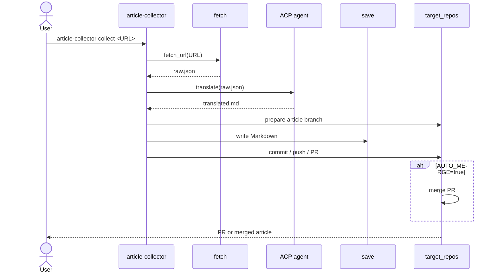

# article-collector

URL -> 記事取得 -> 翻訳 -> PR 作成を自動化する Rust 製 CLI ツール。

ACP agent 経由で翻訳できる。

## セットアップ

### 推奨: GitHub Releases から取得

Release workflow により作成された latest release のビルド済みバイナリを利用する。
Rust toolchain は不要。

| Platform | Asset |
|----------|-------|
| Linux amd64 | `article-collector-linux-amd64` |
| Linux arm64 | `article-collector-linux-arm64` |
| Windows amd64 | `article-collector-windows-amd64.exe` |
| macOS amd64 (Intel) | `article-collector-macos-amd64` |
| macOS arm64 (Apple Silicon) | `article-collector-macos-arm64` |

```bash
# Linux / macOS
ASSET=article-collector-linux-amd64
curl -L -o article-collector "https://github.com/rurusasu/article-collector/releases/latest/download/${ASSET}"
chmod +x article-collector
mkdir -p "$HOME/.local/bin"
mv article-collector "$HOME/.local/bin/article-collector"
```

```powershell
# Windows PowerShell
$asset = "article-collector-windows-amd64.exe"
$binDir = "$env:USERPROFILE\bin"
New-Item -ItemType Directory -Force $binDir | Out-Null
Invoke-WebRequest `
  -Uri "https://github.com/rurusasu/article-collector/releases/latest/download/$asset" `
  -OutFile "$binDir\article-collector.exe"
```

### 代替: cargo install

Rust toolchain / Cargo が入っている環境では、source から直接インストールできる。
Release asset が使えない環境での fallback としても使える。

```bash
cargo install --git https://github.com/rurusasu/article-collector --locked
```

Windows で `cargo` が未導入の場合は、先に Rust を入れる:

```powershell
winget install Rustlang.Rustup
```

新しい PowerShell を開き直してから、上の `cargo install` を実行する。

### GitHub CLI の認証

`pr` / `collect` の PR 作成ステップは `gh` CLI を使うため、事前に認証が必要:

```bash
gh auth login
```

## 処理フロー

`article-collector collect <URL>` の全体フロー:



## クイックスタート

fetch のみなら翻訳 agent や GitHub 認証なしで試せる。

```bash
article-collector fetch https://news.ycombinator.com/item?id=42575537
```

レコメンド/関連リンクを上位30件集める場合:

```bash
article-collector recommend hackernews --limit 30
article-collector recommend zenn --limit 30
article-collector recommend arxiv --limit 10
article-collector recommend arxiv --query "cat:cs.CV OR cat:cs.LG" --limit 10
article-collector recommend github-advisory --limit 10
article-collector recommend cisa-kev --limit 10
article-collector recommend nvd --query "openssl" --limit 5
article-collector recommend aws-whatsnew --limit 5
article-collector recommend github-search --query "stars:>1000 pushed:>2026-01-01 archived:false" --limit 5
```

登録済み site のレコメンド記事をまとめて集め、翻訳まで続ける場合:

```bash
export ACP_AGENT="codex"
article-collector recommend all --limit 30
```

`ACP_AGENT` が未設定の場合は `raw.json` 作成後に翻訳を skip する。

`article-collector.toml` が current directory にある場合、`recommend all` は source 別設定を読み込む。別パスの設定を使う場合は `--config` を指定する。

```bash
article-collector recommend all --config article-collector.toml
```

推薦 URL の記事本文も取得し、記事ごとの JSON / 翻訳 Markdown を作成する場合:

```toml
[recommend]
fetch_articles = true
```

```bash
article-collector recommend all --limit 30 --config article-collector.toml
article-collector recommend hackernews --limit 10 --config article-collector.toml
article-collector recommend https://example.com/links --limit 5 --config article-collector.toml
```

`[recommend].fetch_articles = true` にすると、推薦一覧を取得した後に各 URL の記事本文も取得する。一時成果物は `ARTICLE_COLLECTOR_TEMP_DIR` 配下に作成される。

```text
raw.json
translated.md
recommended_articles/
  001-hackernews-example-title.json
  001-hackernews-example-title_translated.md
recommend-fetch-failures.json
```

`translated.md` は結合本文ではなく、記事別翻訳ファイルへの index として作成される。

本文取得に失敗した URL は `raw.json` や `translated.md` には入れず、`recommend-fetch-failures.json` に `url`, `title`, `stage`, `error` を保存する。`ACP_AGENT` が未設定の場合は記事別 JSON だけを作成し、翻訳ファイル、`translated.md` index、SQLite seen 記録は作成しない。`ACP_AGENT` が設定されている場合、SQLite seen には記事別翻訳まで成功した item だけを記録する。

PDF URL は現時点では本文取得対象外で、`recommend-fetch-failures.json` に `stage: "unsupported_pdf"` として記録される。PDF 本文抽出は coming soon。

取得・翻訳できた推薦記事を target repo に保存し、1つの PR にまとめて作成する場合:

```toml
[recommend]
fetch_articles = true
create_pr = true
```

```bash
export ACP_AGENT="codex"
export TARGET_REPO="your-org/your-repo"
article-collector recommend all --config article-collector.toml
```

`[recommend].create_pr = true` は `[recommend].fetch_articles = true` が必須。翻訳済み記事が 0 件の場合、target repo の clone / branch 作成前に非ゼロ終了する。PR には `recommended_articles/*_translated.md` ではなく、target repo の `SAVE_PATH_TEMPLATE` に従って保存した Markdown 記事ファイルをすべて含める。

収集・翻訳中の一時ディレクトリと最終成果物の保存先を分ける場合は、`ARTICLE_COLLECTOR_TEMP_DIR` を temporary directory として使い、`ARTICLE_COLLECTOR_OUTPUT_DIR` に最終成果物の保存先を指定する。`ARTICLE_COLLECTOR_OUTPUT_DIR` が設定されている場合、保存ステップ後に target repo 内の `*-news` directory 配下を走査し、`.md` files のみを相対パスを保って最終成果物ディレクトリへコピーする。JSON など Markdown 以外の files や `*-news` 以外の directory はコピーしない。

全工程を実行する場合:

Codex を ACP 経由で使う場合:

```bash
codex login
export ACP_AGENT="codex"
export TARGET_REPO="your-org/your-repo"

article-collector collect https://news.ycombinator.com/item?id=42575537
```

翻訳済み Markdown の保存と PR 作成を分けて実行する場合:

```bash
article-collector save https://news.ycombinator.com/item?id=42575537
article-collector pr articles/web/2026-06-23_example.md
article-collector pr D:/tmp/article-collector-target-repo/articles/web/2026-06-23_example.md
```

Codex 以外の agent を使う場合だけ、`ACP_AGENT` に短い名前を指定する:

```bash
export ACP_AGENT="gemini"
```

## コマンド一覧

| コマンド | 役割 | 主な出力 / 副作用 |
|----------|------|-------------------|
| `article-collector collect <URL>` | 取得、翻訳、保存、PR 作成をまとめて実行 | `raw.json` / `translated.md` を作成し、保存先 repo に PR を作成 |
| `article-collector fetch <URL>` | URL から記事本文を取得 | `raw.json` を作成 |
| `article-collector translate [INPUT_JSON]` | 取得済み JSON を翻訳。省略時は `raw.json` を読む | `translated.md` を作成 |
| `article-collector save <URL>` | 翻訳済み Markdown を target repo の `article/<timestamp>` branch に保存 | target repo に Markdown ファイルを作成。commit / PR はしない |
| `article-collector pr <PATH>` | 保存済み Markdown を commit / push して PR 作成 | `PATH` は target repo 相対 path または target repo 配下の絶対 path |
| `article-collector recommend <SITE_OR_URL> --limit 30` | site 名または起点 URL からレコメンド/関連リンクを収集 | `raw.json` に推薦一覧を作成 |
| `article-collector recommend arxiv --query "<QUERY>" --limit 10` | arXiv API query から新着論文を収集 | `raw.json` に論文推薦一覧を作成 |
| `article-collector recommend github-advisory --limit 10` | GitHub Global Security Advisories API から公開 advisory を収集 | `raw.json` に security advisory 推薦一覧を作成 |
| `article-collector recommend cisa-kev --limit 10` | CISA KEV catalog から悪用確認済み CVE を収集 | CVE ごとの NVD URL を使った推薦一覧を作成 |
| `article-collector recommend github-search --query "<QUERY>" --limit 5` | GitHub Search API から OSS repository 候補を収集 | `raw.json` に repository 推薦一覧を作成 |
| `article-collector recommend all --limit 30` | recommend source が設定された全 site から推薦記事を収集し、翻訳まで実行 | `raw.json` に推薦一覧を作成。`ACP_AGENT` 設定時は `translated.md` も作成 |
| `article-collector recommend all --config article-collector.toml` | source 別 config を使って全 site から推薦記事を収集 | `raw.json` に推薦一覧を作成。arXiv query / source 別 limit / 記事本文取得 / PR 作成を config で上書き |

## 設定

| Variable | Required | Default | Description |
|----------|----------|---------|-------------|
| `ARTICLE_COLLECTOR_TEMP_DIR` | No | OS 依存 | `raw.json` / `translated.md` / `recommended_articles/` など収集・翻訳中に使う temporary directory |
| `ARTICLE_COLLECTOR_OUTPUT_DIR` | No | - | target repo 内の `*-news` directory 配下にある `.md` files をコピーする最終成果物 directory |
| `ACP_AGENT` | Yes | - | 内蔵 mapping から選ぶ ACP agent。`codex` / `gemini` / `claude` |
| `TRANSLATE_LANG` | No | `ja` | 翻訳先言語コード |
| `TARGET_REPO` | Yes | - | 保存先 GitHub リポジトリ (`owner/repo`) |
| `TARGET_DIR` | No | OS 依存 | 保存先 repo のローカル clone 先 |
| `SAVE_PATH_TEMPLATE` | No | `articles/${TYPE}/` | 保存先パステンプレート |
| `AUTO_MERGE` | No | `true` | PR 作成後に merge する |

\* 未指定または空文字の場合、翻訳は実行されず `translated.md` は作成されない。`collect` は保存/PR 作成に進まない。
\*\* `save` / `pr` / `collect` の保存・PR ステップのみ必要。

### TOML config

`article-collector.toml` は current directory から自動検出する。明示的に別ファイルを使う場合は `--config <PATH>` を指定する。

```toml
[recommend]
sources = [
  "hackernews",
  "devto",
  "zenn",
  "arxiv",
  "github-advisory",
  "cisa-kev",
  "nvd",
  "aws-whatsnew",
  "aws-security",
  "google-cloud-blog",
  "kubernetes",
  "cncf",
  "infoq",
  "martinfowler",
  "github-search",
]
limit = 30
fetch_articles = false
create_pr = false
# history_path = "D:/article-collector-data/recommend-history.sqlite"

[recommend.source.arxiv]
limit = 10
query = "cat:cs.AI OR cat:cs.CL OR cat:cs.CV OR cat:cs.LG OR cat:cs.IR OR cat:cs.SE OR cat:stat.ML"

[recommend.source.github-advisory]
limit = 10

[recommend.source.cisa-kev]
limit = 10

[recommend.source.nvd]
limit = 5

[recommend.source.github-search]
limit = 5
query = "stars:>1000 pushed:>2026-01-01 archived:false"
```

優先順位は CLI 明示指定、source 別 config、recommend 全体 config、コード内 default の順。`recommend all --query ...` は引き続き拒否する。`query` は `arxiv`, `nvd`, `github-search` など query 対応 source の単体実行または `[recommend.source.<site>]` で指定する。`github-advisory`, `cisa-kev`, RSS/Atom feed 系 source は query 非対応。記事本文取得と PR 作成は CLI flag ではなく `[recommend].fetch_articles` / `[recommend].create_pr` で指定する。

### ACP agent 利用時の注意

`article-collector` は `ACP_AGENT` の内蔵 mapping で解決した agent を subprocess として起動し、ACP v1 の `initialize`、`session/new`、`session/prompt` を使う。
article-collector は翻訳用途の client として動作するため、file system / terminal capability は広告しない。
agent から `session/request_permission` が来た場合は `cancelled` で応答する。

内蔵 mapping:

| `ACP_AGENT` | Command |
|-------------|---------|
| `codex` | `npx -y @agentclientprotocol/codex-acp` |
| `gemini` | `gemini --acp` |
| `claude` | `npx -y @agentclientprotocol/claude-agent-acp` |

共有サービス、本番バッチ、チームでの継続的な自動化では、利用する ACP agent の認証方式、課金、利用規約を確認する。

参考:

- [Agent Client Protocol](https://agentclientprotocol.com/)
- [ACP agents](https://agentclientprotocol.com/get-started/agents)

## 対応 URL と保存分類

取得ルートと保存時の `${TYPE}` 分類は別に判定する。

| 対象 URL | 取得方法 | 保存 `${TYPE}` | Auth / 制約 |
|----------|----------|----------------|-------------|
| Dev.to | Dev.to public API | `web` | None |
| X/Twitter status (`x.com` / `twitter.com`) | Syndication API | `x` | Public tweets only |
| YouTube (`youtube.com/watch` / `youtu.be`) | oEmbed + transcript fetch | `youtube` | None |
| Hacker News item | Firebase public API | `web` | None |
| Zenn | generic web fetch | `web` | None |
| arXiv | generic web fetch | `paper` | None |
| GitHub Advisory (`github.com/advisories`) | generic web fetch | `web` | Public API rate limit applies to recommend collection |
| CISA KEV / NVD CVE (`nvd.nist.gov/vuln/detail`) | generic web fetch | `web` | CISA catalog items use CVE-specific NVD URLs for dedupe |
| AWS official pages | generic web fetch | `web` | RSS recommend sources: What's New, Security Bulletins |
| Google Cloud Blog | generic web fetch | `web` | RSS recommend source |
| Kubernetes Blog | generic web fetch | `web` | RSS recommend source |
| CNCF Blog | generic web fetch | `web` | RSS recommend source |
| InfoQ | generic web fetch | `web` | RSS recommend source |
| Martin Fowler | generic web fetch | `web` | Atom recommend source |
| GitHub repositories (`github.com/<owner>/<repo>`) | generic web fetch | `web` | GitHub Search API rate limit applies to recommend collection |
| Thoughtworks Radar | generic web fetch | `web` | Manual URL fallback only; stable machine-readable Radar feed/API is not confirmed |
| DOI (`doi.org`) | generic web fetch | `paper` | None |
| OpenReview | generic web fetch | `paper` | None |
| その他の `http://` / `https://` URL | generic web fetch | `web` | None |

### レコメンド収集

`article-collector recommend <SITE_OR_URL>` は `raw.json` に推薦一覧を保存する。`hackernews` / `hn` では Firebase `topstories` からリンク付き story を上位30件取得する。`devto` / `dev.to` では Dev.to public API から上位記事を取得する。`zenn` では Zenn トレンド RSS を取得する。`arxiv` では arXiv API から AI / NLP / Computer Vision / Machine Learning 系の新着論文を取得する。`github-advisory` / `github-advisories` / `ghsa` では GitHub Global Security Advisories API から公開 advisory を取得する。`cisa-kev`, `nvd`, `aws-whatsnew`, `aws-security`, `google-cloud-blog`, `kubernetes`, `cncf`, `infoq`, `martinfowler`, `github-search` も recommend source として利用できる。その他の `http://` / `https://` URL ではページ内リンクを上から抽出する。

`article-collector recommend arxiv --query "cat:cs.CV OR cat:cs.LG" --limit 10` や `article-collector recommend github-search --query "stars:>1000 pushed:>2026-01-01 archived:false" --limit 5` のように `--query` を指定すると、query 対応 source の検索条件を上書きできる。`--query` は `arxiv`, `nvd`, `github-search` など query 対応 source 専用で、`all` や URL fallback では使用しない。

`article-collector recommend all --limit 30` は registry で recommend source が設定された全 site から、それぞれ最大30件ずつ取得して 1 つの `raw.json` にまとめる。現在の対象は `hackernews`, `devto`, `zenn`, `arxiv`, `github-advisory`, `cisa-kev`, `nvd`, `aws-whatsnew`, `aws-security`, `google-cloud-blog`, `kubernetes`, `cncf`, `infoq`, `martinfowler`, `github-search`。`thoughtworks-radar` は安定した machine-readable feed/API が確認できていないため、`recommend all` には含めず、URL fallback のみ対応する。`article-collector.toml` の `[recommend]` / `[recommend.source.<site>]` で source 順序、enabled、limit、query、記事本文取得を上書きできる。その後、`ACP_AGENT` が設定されていれば同じ入力を翻訳して `translated.md` を作成する。`ACP_AGENT` が未設定または空文字の場合、翻訳は skip される。YouTube のチャンネル RSS / API-key 検索は第2弾で扱う。

`recommend` は SQLite の既読履歴で過去に `raw.json` へ出力した記事 URL を管理し、次回以降は同じ記事を `raw.json` に出力しない。`ARTICLE_COLLECTOR_TEMP_DIR` は `raw.json` / `translated.md` / `recommended_articles/` など収集・翻訳中の temporary directory だけを変更し、履歴 DB の場所や最終成果物の保存先は変更しない。履歴 DB は既定ではユーザー設定ディレクトリ配下の `article-collector/recommend-history.sqlite` に作成する。別の場所を使う場合は `[recommend].history_path` を指定する。候補自体が 0 件の場合は `No recommended articles found for <target>`、全候補が既読だった場合は `No new recommended articles found for <target>` で非ゼロ終了する。

## 開発

```bash
cargo fmt --check
cargo clippy --all-targets -- -D warnings
taplo format --check Cargo.toml article-collector.toml release-plz.toml
taplo lint Cargo.toml article-collector.toml release-plz.toml
cargo test --locked
cargo build --release --locked
```

外部サービスへ実アクセスする live test は通常の `cargo test --locked` では skip される。recommend source の実疎通を確認する場合は `cargo test --locked recommend::tests::collects_recommendations_from_every_registered_site -- --ignored --nocapture` を使う。

Taskfile は Rust CLI の薄いラッパーとして使える:

```bash
task fetch URL=https://example.com/article
task recommend TARGET=hackernews LIMIT=30
task recommend TARGET=arxiv LIMIT=10 QUERY="cat:cs.CV OR cat:cs.LG"
task recommend TARGET=all LIMIT=30 CONFIG=article-collector.toml
task translate
task check
```

## リリース

`main` に push されると `.github/workflows/release.yml` が実行される。
通常の PR merge では release-plz が Release PR を作成・更新する。Release PR が merge されると workflow が `Cargo.toml` の version から `v0.7.0` 形式の tag を解決し、GitHub Release と各 OS 向け asset を同じ workflow 内で作成する。

release-plz は `git_only = true` で動かすため、Release PR の version 判定は git tag を基準にする。今後の tag は release-plz の default に合わせて `v0.7.0` のような形式を使う。移行時は旧 `article-collector-v0.6.1` tag と同じ commit に `v0.6.1` の baseline tag を一度だけ作成してから運用する。

```bash
git fetch origin --tags
git tag v0.6.1 article-collector-v0.6.1
git push origin v0.6.1
```

詳細: [docs/ci-cd/README.md](docs/ci-cd/README.md)

## トラブルシューティング

### `cargo` が見つからない

Rust toolchain をインストールしてから、新しい shell を開き直す。

```bash
curl --proto '=https' --tlsv1.2 -sSf https://sh.rustup.rs | sh
source "$HOME/.cargo/env"
```

### リリースのダウンロードが失敗する

asset 名が platform と一致しているか、latest release に対象 asset があるかを確認する。
急ぐ場合や対象 platform の asset がない場合は、`cargo install --git https://github.com/rurusasu/article-collector --locked` を使う。

### `gh article-collector` として使いたい

現在の構成は通常の CLI (`article-collector`) 用。
GitHub CLI extension として `gh article-collector ...` で使うには、別途 `gh-article-collector` 名の実行ファイルまたは GitHub CLI extension 用の repo 構成が必要。

## ライセンス

MIT
