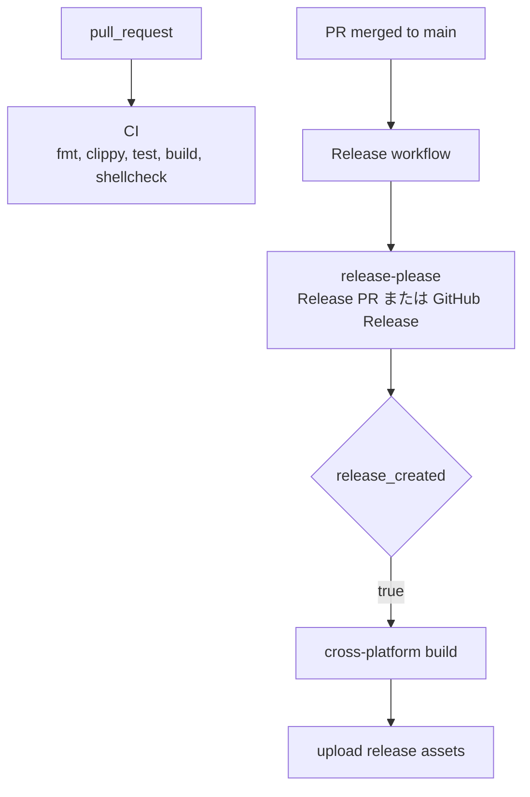

# CI/CD Pipeline

## Overview

GitHub Actions で Rust CLI の検証とリリースを実行する。
バージョン管理と GitHub Release 作成は [release-please](https://github.com/googleapis/release-please) で自動化している。

## 全体フロー

## CI (`ci.yml`)

**トリガー:** PR 作成・更新時

| Job | 内容 | キャッシュ |
|-----|------|-----------|
| Rust Check | `cargo fmt --check`, `cargo clippy --all-targets`, `cargo test --locked`, `cargo build --release --locked` | cargo registry & build |
| TOML Check | `taplo format --check`, `taplo lint` | なし |
| Script Lint | `scripts/*.sh` の shellcheck | なし |

旧シェル実装と bats テストは削除済み。記事取得・翻訳・保存の検証は Rust ユニットテストで行う。

## Release (`release.yml`)

**トリガー:** `main` 宛の PR が merge されたとき、または手動実行

通常の feature/fix PR が merge されると release-please が Release PR を作成または更新する。
Release PR が merge されると同じ workflow 内で GitHub Release が作成され、各プラットフォーム向けバイナリをビルドして asset としてアップロードする。

| Asset | Target |
|-------|--------|
| `article-collector-linux-amd64` | `x86_64-unknown-linux-gnu` |
| `article-collector-linux-arm64` | `aarch64-unknown-linux-gnu` |
| `article-collector-windows-amd64.exe` | `x86_64-pc-windows-msvc` |
| `article-collector-macos-amd64` | `x86_64-apple-darwin` |
| `article-collector-macos-arm64` | `aarch64-apple-darwin` |

> デフォルト `GITHUB_TOKEN` による Release 作成は別 workflow を起動しないため、Release 作成と asset build/upload は同一 workflow に置いている。

### セキュリティ

- `permissions: contents: write` は tag / GitHub Release / asset upload に必要
- `permissions: pull-requests: write` は Release PR 作成・更新に必要
- build は `--locked` で `Cargo.lock` の整合性を検証する

## ワークフローファイル

| ファイル | 用途 |
|---------|------|
| `.github/workflows/ci.yml` | PR CI |
| `.github/workflows/release.yml` | Release PR 作成 + GitHub Release + asset build/upload |
| `.github/workflows/pr-checklist.yml` | PR checklist 検証 |
| `release-please-config.json` | release-please 設定 |
| `.release-please-manifest.json` | release-please のバージョン管理 |
