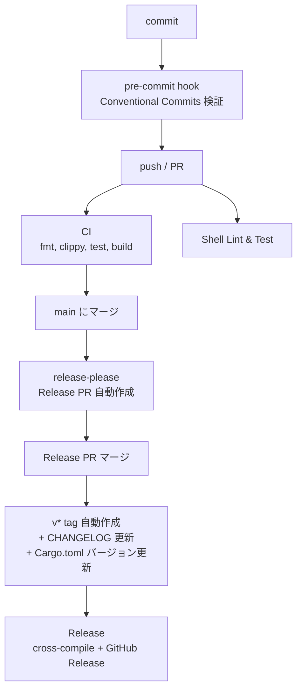
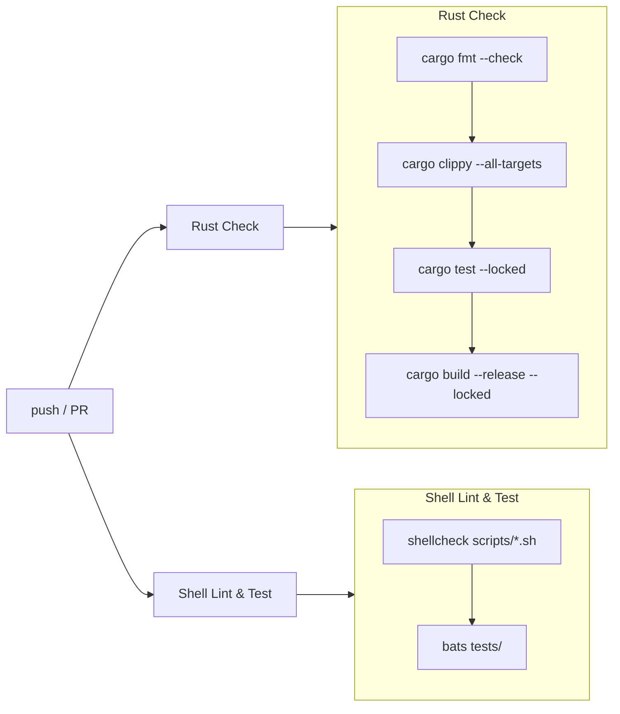
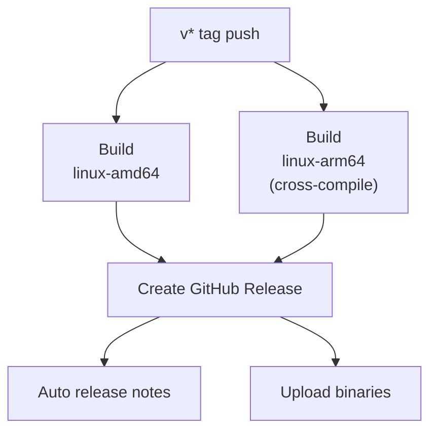

# CI/CD Pipeline

## Overview

GitHub Actions で Rust の CI/CD パイプラインを構築している。
バージョン管理は [release-please](https://github.com/googleapis/release-please) で自動化。

## 全体フロー



## CI (`ci.yml`)

**トリガー:** `main` への push / PR 作成時



| Job | 内容 | キャッシュ |
|-----|------|-----------|
| Rust Check | fmt, clippy, test, release build | cargo registry & build |
| Shell Lint & Test | shellcheck, bats | なし |

- 2 ジョブは **並列実行**
- clippy は `--all-targets` で全ターゲットを lint
- test は `--locked` で Cargo.lock 整合性を検証
- release build で **リリース前のビルド検証** を実施

## Release Please (`release-please.yml`)

**トリガー:** `main` への push 時

Conventional Commits を解析し、自動で:
1. バージョン番号を算出 (`feat` → minor, `fix` → patch, `!` → major)
2. `CHANGELOG.md` を生成
3. `Cargo.toml` の `version` を更新
4. Release PR を作成

Release PR がマージされると `v*` タグが自動作成され、`release.yml` が発火する。

## Release (`release.yml`)

**トリガー:** `v*` タグ push 時



| Job | ターゲット | ツールチェイン |
|-----|-----------|---------------|
| Build (amd64) | `x86_64-unknown-linux-gnu` | stable |
| Build (arm64) | `aarch64-unknown-linux-gnu` | stable + `aarch64-linux-gnu-gcc` |
| Create Release | - | `softprops/action-gh-release@v2` |

### セキュリティ

- `permissions: contents: write` は **Release ジョブのみ** に付与 (最小権限)
- Build ジョブは `contents: read` のみ

### ビルド戦略

- `fail-fast: false` — 片方のアーキテクチャが失敗しても他方は継続
- `--locked` — Cargo.lock の整合性を保証
- cargo キャッシュあり（ターゲットごとに分離）

## Pre-commit Hook

`.githooks/commit-msg` でコミットメッセージが Conventional Commits 形式か検証する。

```
<type>(<scope>): <description>
```

| Type | バージョン影響 | 用途 |
|------|--------------|------|
| `feat` | minor bump | 新機能 |
| `fix` | patch bump | バグ修正 |
| `feat!` / `fix!` | **major bump** | 破壊的変更 |
| `docs` | なし | ドキュメント |
| `ci` | なし | CI/CD |
| `chore` | なし | メンテナンス |
| `refactor` | なし | リファクタリング |
| `test` | なし | テスト |

### セットアップ

devcontainer では `post-create.sh` が自動設定する。手動の場合:

```bash
git config core.hooksPath .githooks
```

## ワークフローファイル

| ファイル | 用途 |
|---------|------|
| `.github/workflows/ci.yml` | CI (fmt, clippy, test, build, shellcheck, bats) |
| `.github/workflows/release-please.yml` | Release PR 自動作成 |
| `.github/workflows/release.yml` | Release (cross-compile, GitHub Releases) |
| `.githooks/commit-msg` | Conventional Commits 検証 |
