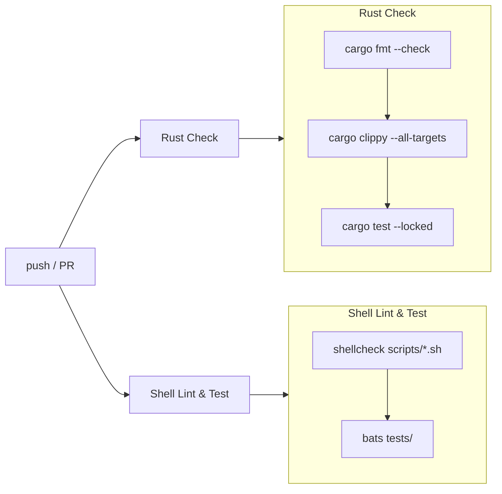
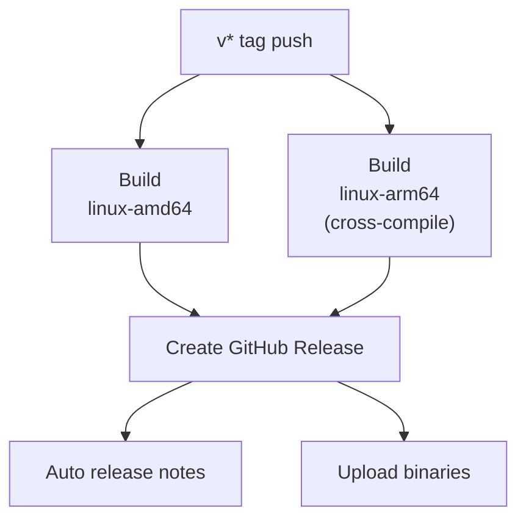

# CI/CD Pipeline

## Overview

GitHub Actions で Rust の CI/CD パイプラインを構築している。

## CI (`ci.yml`)

**トリガー:** `main` への push / PR 作成時

| Job | 内容 | キャッシュ |
|-----|------|-----------|
| Rust Check | fmt, clippy, test | cargo registry & build |
| Shell Lint & Test | shellcheck, bats | なし |

- 2 ジョブは **並列実行**
- clippy は `--all-targets` で全ターゲットを lint
- test は `--locked` で Cargo.lock 整合性を検証

## Release (`release.yml`)

**トリガー:** `v*` タグ push 時 (例: `git tag v0.1.0 && git push --tags`)

| Job | ターゲット | ツールチェイン |
|-----|-----------|---------------|
| Build (amd64) | `x86_64-unknown-linux-gnu` | stable |
| Build (arm64) | `aarch64-unknown-linux-gnu` | stable + `aarch64-linux-gnu-gcc` |
| Create Release | - | `softprops/action-gh-release@v2` |

### セキュリティ

- `permissions: contents: write` は **Release ジョブのみ** に付与 (最小権限)
- Build ジョブは `contents: read` のみ

### ビルド戦略

- `fail-fast: false` — 片方のアーキテクチャが失敗しても他方は継続
- `--locked` — Cargo.lock の整合性を保証
- cargo キャッシュあり（ターゲットごとに分離）

## ワークフローファイル

| ファイル | 用途 |
|---------|------|
| `.github/workflows/ci.yml` | CI (fmt, clippy, test, shellcheck, bats) |
| `.github/workflows/release.yml` | Release (cross-compile, GitHub Releases) |
