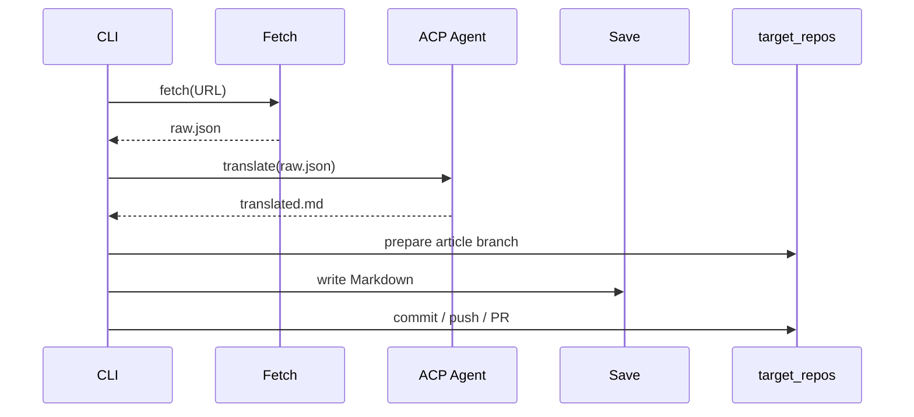

# Save And Target Repos CLI Split Implementation Plan

> **For agentic workers:** REQUIRED SUB-SKILL: Use superpowers:subagent-driven-development (recommended) or superpowers:executing-plans to implement this plan task-by-task. Steps use checkbox (`- [ ]`) syntax for tracking.

**Goal:** Replace the combined `save-and-pr` command with separate `save <URL>` and `pr <PATH>` commands while keeping `collect <URL>` as the end-to-end workflow.

**Architecture:** Keep Markdown article generation in `save.rs` and move all target repository, git, GitHub CLI, branch, and path-safety behavior into a new `target_repos.rs` module. `main.rs` becomes the orchestrator: `save` prepares a target branch through `target_repos` and then asks `save` to write a Markdown file; `pr` commits and opens the PR; `collect` composes fetch, translate, save, and PR.

**Tech Stack:** Rust stable, clap, chrono, serde_json, anyhow, std::process::Command, existing `cargo test --locked` workflow.

---

## File Structure

- Modify: `src/main.rs`
  - Add `mod target_repos;`.
  - Replace `SaveAndPr { url }` with `Save { url }` and `Pr { path }`.
  - Keep `Collect { url }`, but internally call `target_repos` and `save` as separate steps.
- Modify: `src/save.rs`
  - Remove git, branch, `gh`, clone, push, PR, and auto-merge behavior.
  - Keep article Markdown generation, title sanitization, slug generation, type detection, save path resolution, and local file writing.
  - Export a pure local save API that accepts a target root path.
- Create: `src/target_repos.rs`
  - Own `TARGET_REPO`, `TARGET_DIR`, `AUTO_MERGE`.
  - Own clone/update, branch creation, current branch detection, path validation, git add/commit/push, PR creation, and auto merge.
- Modify: `tests/cli.rs`
  - Verify root help exposes `save` and `pr`.
  - Verify root help no longer exposes `save-and-pr`.
- Modify: `README.md`
  - Update command table and flow diagram.
  - Document `save <URL>`, `pr <PATH>`, `collect <URL>`, and removal of `save-and-pr`.

---

### Task 1: CLI Contract Tests

**Files:**
- Modify: `tests/cli.rs`
- Modify: `src/main.rs`

- [ ] **Step 1: Write failing CLI help test**

Add this test to `tests/cli.rs`:

```rust
#[test]
fn root_help_lists_save_and_pr_but_not_save_and_pr() {
    let output = Command::new(env!("CARGO_BIN_EXE_article-collector"))
        .arg("--help")
        .output()
        .expect("run article-collector --help");

    assert!(
        output.status.success(),
        "expected --help to succeed, stderr: {}",
        String::from_utf8_lossy(&output.stderr)
    );

    let stdout = String::from_utf8(output.stdout).expect("help output should be valid UTF-8");
    assert!(stdout.contains("save "), "help should list save command:\n{stdout}");
    assert!(stdout.contains("pr "), "help should list pr command:\n{stdout}");
    assert!(
        !stdout.contains("save-and-pr"),
        "help should not list removed save-and-pr command:\n{stdout}"
    );
}
```

- [ ] **Step 2: Run test to verify it fails**

Run:

```bash
cargo test --locked --test cli root_help_lists_save_and_pr_but_not_save_and_pr
```

Expected: FAIL because `save` and `pr` do not exist yet and `save-and-pr` is still listed.

- [ ] **Step 3: Add new CLI variants and remove `save-and-pr`**

In `src/main.rs`, change the command enum shape to:

```rust
#[derive(Subcommand)]
enum Commands {
    /// 記事取得 → 翻訳 → 保存 → PR（全工程）
    Collect {
        /// 取得する記事の URL
        url: String,
    },
    /// URL から記事を取得
    Fetch {
        /// 取得する記事の URL
        url: String,
    },
    /// 取得した記事を翻訳
    Translate {
        /// 入力 JSON ファイルパス
        input: Option<PathBuf>,
    },
    /// 翻訳記事を target repo の作業ブランチへ保存
    Save {
        /// 元記事の URL
        url: String,
    },
    /// 保存済み Markdown を commit / push して PR 作成
    Pr {
        /// target repo からの相対 path、または target repo 配下の絶対 path
        path: PathBuf,
    },
    /// 推薦記事/関連リンクをまとめて取得
    Recommend {
        /// 推薦記事を探す site 名、all、または起点 URL
        target: String,
        /// 収集する最大件数
        #[arg(short, long)]
        limit: Option<usize>,
        /// arXiv など query 対応 source の検索条件
        #[arg(long)]
        query: Option<String>,
        /// article-collector TOML config のパス
        #[arg(long, value_name = "PATH")]
        config: Option<PathBuf>,
    },
}
```

Add `mod target_repos;` near the other module declarations. Add temporary compile-safe match arms for the new commands; Task 4 replaces these with real implementations:

```rust
Commands::Save { .. } => {
    anyhow::bail!("save command is not wired yet");
}
Commands::Pr { .. } => {
    anyhow::bail!("pr command is not wired yet");
}
```

- [ ] **Step 4: Run CLI help test**

Run:

```bash
cargo test --locked --test cli root_help_lists_save_and_pr_but_not_save_and_pr
```

Expected: PASS once the enum exposes `save` and `pr` and no longer exposes `save-and-pr`.

- [ ] **Step 5: Commit**

```bash
git add src/main.rs tests/cli.rs
git commit -m "feat: split save and pr cli commands"
```

---

### Task 2: Extract Local Markdown Saving

**Files:**
- Modify: `src/save.rs`

- [ ] **Step 1: Write failing local-save tests**

Add these tests to `src/save.rs` under the existing test module:

```rust
#[test]
fn builds_article_markdown_with_frontmatter() {
    let raw = serde_json::json!([{
        "title": "Example Article",
        "content": "Original content"
    }]);

    let markdown = build_article_markdown(
        &raw,
        "Translated body",
        "https://example.com/article",
        "2026-06-23",
    )
    .unwrap();

    assert!(markdown.contains("title: \"Example Article\""));
    assert!(markdown.contains("type: web"));
    assert!(markdown.contains("url: \"https://example.com/article\""));
    assert!(markdown.contains("created: 2026-06-23"));
    assert!(markdown.ends_with("Translated body"));
}

#[test]
fn writes_article_markdown_under_target_root() {
    let suffix = std::time::SystemTime::now()
        .duration_since(std::time::UNIX_EPOCH)
        .unwrap()
        .as_nanos();
    let target_root = std::env::temp_dir().join(format!(
        "article-collector-save-test-{}-{suffix}",
        std::process::id()
    ));
    std::fs::create_dir_all(&target_root).unwrap();

    let raw = serde_json::json!([{
        "title": "Example Article",
        "content": "Original content"
    }]);

    let saved = write_article_markdown_to_target(
        &target_root,
        "https://example.com/article",
        &raw,
        "Translated body",
        "articles/${TYPE}/",
        "2026-06-23",
    )
    .unwrap();

    assert_eq!(
        saved.repo_relative_path,
        std::path::PathBuf::from("articles/web/2026-06-23_example-article.md")
    );
    assert!(saved.path.exists());
    assert!(std::fs::read_to_string(saved.path).unwrap().contains("Translated body"));
}
```

- [ ] **Step 2: Run tests to verify they fail**

Run:

```bash
cargo test --locked save::tests::builds_article_markdown_with_frontmatter
cargo test --locked save::tests::writes_article_markdown_under_target_root
```

Expected: FAIL to compile because `build_article_markdown`, `write_article_markdown_to_target`, and `SavedArticle` do not exist yet.

- [ ] **Step 3: Add local-save API**

In `src/save.rs`, add this struct near the top:

```rust
#[derive(Debug, PartialEq, Eq)]
pub struct SavedArticle {
    pub path: PathBuf,
    pub repo_relative_path: PathBuf,
    pub title: String,
}
```

Add these functions above `sanitize_title`:

```rust
pub fn save_article_to_target(target_root: &Path, url: &str) -> Result<SavedArticle> {
    if !url.starts_with("http://") && !url.starts_with("https://") {
        bail!("Invalid URL: {url}");
    }

    let outdir = paths::outdir();
    let raw_path = outdir.join("raw.json");
    let translated_path = paths::translated_md_path();
    let raw = fs::read_to_string(&raw_path).context("Failed to read raw.json")?;
    let data: Value = serde_json::from_str(&raw)?;
    let translated = fs::read_to_string(&translated_path).unwrap_or_default();

    if translated.is_empty() || translated.trim() == "null" {
        bail!("Translation result is empty or null, aborting");
    }

    let save_path_template =
        std::env::var("SAVE_PATH_TEMPLATE").unwrap_or_else(|_| "articles/${TYPE}/".to_string());
    let now = Local::now().format("%Y-%m-%d").to_string();

    write_article_markdown_to_target(target_root, url, &data, &translated, &save_path_template, &now)
}

pub fn write_article_markdown_to_target(
    target_root: &Path,
    url: &str,
    data: &Value,
    translated: &str,
    save_path_template: &str,
    now: &str,
) -> Result<SavedArticle> {
    let title = extract_title(data);
    let title = sanitize_title(title);
    let slug = title_to_slug(&title);
    let filename = format!("{now}_{slug}.md");
    let article_type = determine_type(url);
    let save_path = save_path_template.replace("${TYPE}", &article_type);
    let dest_dir = target_root.join(&save_path);
    fs::create_dir_all(&dest_dir)?;
    let dest_file = dest_dir.join(&filename);
    let content = build_article_markdown(data, translated, url, now)?;
    fs::write(&dest_file, content)?;

    Ok(SavedArticle {
        path: dest_file,
        repo_relative_path: PathBuf::from(save_path).join(filename),
        title,
    })
}

pub fn build_article_markdown(
    data: &Value,
    translated: &str,
    url: &str,
    now: &str,
) -> Result<String> {
    if translated.is_empty() || translated.trim() == "null" {
        bail!("Translation result is empty or null, aborting");
    }

    let title = sanitize_title(extract_title(data));
    let article_type = determine_type(url);
    let frontmatter = format!(
        "---\ntitle: \"{title}\"\ntype: {article_type}\nurl: \"{url}\"\ncreated: {now}\ntags: []\n---\n\n"
    );

    Ok(format!("{frontmatter}{translated}"))
}

fn extract_title(data: &Value) -> &str {
    if let Some(arr) = data.as_array() {
        arr.first()
            .and_then(|item| {
                item.get("title").and_then(|t| t.as_str()).or_else(|| {
                    item.get("text")
                        .and_then(|t| t.as_str())
                        .map(|s| &s[..s.len().min(80)])
                })
            })
            .unwrap_or("untitled")
    } else {
        data.get("title")
            .and_then(|t| t.as_str())
            .unwrap_or("untitled")
    }
}
```

Keep `sanitize_title`, `title_to_slug`, and `determine_type` public. Leave `save_and_pr` in place until Task 4 removes it, so behavior is not broken mid-task.

- [ ] **Step 4: Run local-save tests**

Run:

```bash
cargo test --locked save::tests::builds_article_markdown_with_frontmatter
cargo test --locked save::tests::writes_article_markdown_under_target_root
```

Expected: PASS.

- [ ] **Step 5: Commit**

```bash
git add src/save.rs
git commit -m "refactor: extract local article saving"
```

---

### Task 3: Add Target Repo Module

**Files:**
- Create: `src/target_repos.rs`
- Modify: `src/main.rs`

- [ ] **Step 1: Write target repo path tests**

Create `src/target_repos.rs` with tests first:

```rust
use anyhow::{bail, Context, Result};
use chrono::Local;
use std::path::{Path, PathBuf};
use std::process::Command;

#[cfg(test)]
mod tests {
    use super::*;

    #[test]
    fn resolves_relative_path_under_target_dir() {
        let target_dir = normalized_temp_path("target-repo-relative");
        let resolved = resolve_repo_path(&target_dir, Path::new("articles/web/example.md")).unwrap();

        assert_eq!(resolved, target_dir.join("articles/web/example.md"));
    }

    #[test]
    fn accepts_absolute_path_under_target_dir() {
        let target_dir = normalized_temp_path("target-repo-absolute");
        let input = target_dir.join("articles/web/example.md");
        let resolved = resolve_repo_path(&target_dir, &input).unwrap();

        assert_eq!(resolved, input);
    }

    #[test]
    fn rejects_path_outside_target_dir() {
        let target_dir = normalized_temp_path("target-repo-outside");
        let outside = normalized_temp_path("other-repo").join("example.md");

        assert!(resolve_repo_path(&target_dir, &outside).is_err());
    }

    fn normalized_temp_path(name: &str) -> PathBuf {
        std::env::temp_dir()
            .join(format!("article-collector-{name}-{}", std::process::id()))
    }
}
```

- [ ] **Step 2: Run tests to verify they fail**

Run:

```bash
cargo test --locked target_repos::tests
```

Expected: FAIL to compile because `target_repos` is not registered and `resolve_repo_path` does not exist.

- [ ] **Step 3: Register module and implement path helpers**

Add to `src/main.rs`:

```rust
mod target_repos;
```

Add this implementation to `src/target_repos.rs` above the tests:

```rust
pub struct PreparedTargetRepo {
    pub target_dir: PathBuf,
    pub branch: String,
}

pub fn target_dir_from_env() -> PathBuf {
    std::env::var("TARGET_DIR")
        .map(PathBuf::from)
        .unwrap_or_else(|_| crate::paths::default_target_dir())
}

pub fn resolve_repo_path(target_dir: &Path, input: &Path) -> Result<PathBuf> {
    let resolved = if input.is_absolute() {
        normalize_path(input)
    } else {
        normalize_path(&target_dir.join(input))
    };
    let target_dir = normalize_path(target_dir);

    if !resolved.starts_with(&target_dir) {
        bail!(
            "Path {} is outside target repo {}",
            resolved.display(),
            target_dir.display()
        );
    }

    Ok(resolved)
}

pub fn repo_relative_path(target_dir: &Path, path: &Path) -> Result<PathBuf> {
    let target_dir = normalize_path(target_dir);
    let path = normalize_path(path);
    path.strip_prefix(&target_dir)
        .map(Path::to_path_buf)
        .with_context(|| {
            format!(
                "Path {} is outside target repo {}",
                path.display(),
                target_dir.display()
            )
        })
}

fn normalize_path(path: &Path) -> PathBuf {
    let mut normalized = PathBuf::new();
    for component in path.components() {
        normalized.push(component.as_os_str());
    }
    normalized
}
```

- [ ] **Step 4: Run target repo path tests**

Run:

```bash
cargo test --locked target_repos::tests
```

Expected: PASS.

- [ ] **Step 5: Commit**

```bash
git add src/main.rs src/target_repos.rs
git commit -m "feat: add target repo path handling"
```

---

### Task 4: Move Git And PR Operations To `target_repos.rs`

**Files:**
- Modify: `src/target_repos.rs`
- Modify: `src/save.rs`
- Modify: `src/main.rs`

- [ ] **Step 1: Add branch and PR functions**

In `src/target_repos.rs`, add:

```rust
pub fn prepare_article_branch() -> Result<PreparedTargetRepo> {
    let target_repo = std::env::var("TARGET_REPO").context("TARGET_REPO env var required")?;
    let target_dir = target_dir_from_env();
    let branch = article_branch_name();

    if target_dir.join(".git").exists() {
        run_git(&target_dir, &["checkout", "main"])?;
        run_git(&target_dir, &["pull", "origin", "main"])?;
    } else {
        let target_dir_arg = target_dir.to_string_lossy().to_string();
        run_cmd("gh", &["repo", "clone", &target_repo, &target_dir_arg])?;
    }

    run_git(&target_dir, &["checkout", "-b", &branch])?;
    Ok(PreparedTargetRepo { target_dir, branch })
}

pub fn create_pr_for_path(path: &Path) -> Result<()> {
    let target_dir = target_dir_from_env();
    let resolved = resolve_repo_path(&target_dir, path)?;
    let rel_path = repo_relative_path(&target_dir, &resolved)?;
    ensure_non_main_branch(&target_dir)?;

    let rel_path_arg = rel_path.to_string_lossy().to_string();
    run_git(&target_dir, &["add", &rel_path_arg])?;
    run_git(
        &target_dir,
        &["commit", "-m", &format!("collect: {}", rel_path.display())],
    )?;
    let branch = current_branch(&target_dir)?;
    run_git(&target_dir, &["push", "-u", "origin", &branch])?;

    let pr_body = format!(
        "## Collected Article\n\n- `{}`",
        rel_path.to_string_lossy()
    );
    run_cmd_in(
        &target_dir,
        "gh",
        &[
            "pr",
            "create",
            "--title",
            &format!("collect: {}", rel_path.display()),
            "--body",
            &pr_body,
        ],
    )?;

    if std::env::var("AUTO_MERGE").unwrap_or_else(|_| "true".to_string()) == "true" {
        run_cmd_in(&target_dir, "gh", &["pr", "merge", "--merge"])?;
    }

    Ok(())
}

fn ensure_non_main_branch(target_dir: &Path) -> Result<()> {
    let branch = current_branch(target_dir)?;
    if branch == "main" {
        let new_branch = article_branch_name();
        run_git(target_dir, &["checkout", "-b", &new_branch])?;
    }
    Ok(())
}

fn current_branch(target_dir: &Path) -> Result<String> {
    let output = Command::new("git")
        .current_dir(target_dir)
        .args(["branch", "--show-current"])
        .output()
        .context("git branch --show-current failed")?;
    if !output.status.success() {
        bail!("git branch --show-current failed with {}", output.status);
    }
    Ok(String::from_utf8_lossy(&output.stdout).trim().to_string())
}

fn article_branch_name() -> String {
    format!("article/{}", Local::now().format("%Y-%m-%d-%H%M%S"))
}

fn run_git(dir: &Path, args: &[&str]) -> Result<()> {
    run_cmd_in(dir, "git", args)
}

fn run_cmd(cmd: &str, args: &[&str]) -> Result<()> {
    let status = Command::new(cmd).args(args).status()?;
    if !status.success() {
        bail!("{cmd} {} failed with {status}", args.join(" "));
    }
    Ok(())
}

fn run_cmd_in(dir: &Path, cmd: &str, args: &[&str]) -> Result<()> {
    let status = Command::new(cmd).current_dir(dir).args(args).status()?;
    if !status.success() {
        bail!("{cmd} {} failed with {status}", args.join(" "));
    }
    Ok(())
}
```

- [ ] **Step 2: Remove git and PR code from `save.rs`**

Delete `save_and_pr`, `run_git`, `run_cmd`, and `run_cmd_in` from `src/save.rs`. Remove the `std::process::Command` import. Keep `save_article_to_target`, `write_article_markdown_to_target`, `build_article_markdown`, `sanitize_title`, `title_to_slug`, and `determine_type`.

- [ ] **Step 3: Wire command execution in `main.rs`**

Replace match arms with:

```rust
Commands::Collect { ref url } => {
    fetch::fetch_url(url).await?;
    if translate::translate(&paths::raw_json_path()).await?
        == translate::TranslateOutcome::Translated
    {
        let prepared = target_repos::prepare_article_branch()?;
        let saved = save::save_article_to_target(&prepared.target_dir, url)?;
        target_repos::create_pr_for_path(&saved.path)?;
    }
}
Commands::Save { ref url } => {
    let prepared = target_repos::prepare_article_branch()?;
    let saved = save::save_article_to_target(&prepared.target_dir, url)?;
    eprintln!("Saved article: {}", saved.path.display());
}
Commands::Pr { ref path } => {
    target_repos::create_pr_for_path(path)?;
}
```

Keep `Fetch`, `Translate`, and `Recommend` arms as they are.

- [ ] **Step 4: Run focused tests**

Run:

```bash
cargo test --locked save::tests
cargo test --locked target_repos::tests
cargo test --locked --test cli
```

Expected: PASS.

- [ ] **Step 5: Commit**

```bash
git add src/main.rs src/save.rs src/target_repos.rs tests/cli.rs
git commit -m "refactor: move target repo operations out of save"
```

---

### Task 5: Update README For New Commands

**Files:**
- Modify: `README.md`

- [ ] **Step 1: Update command table**

Replace the `save-and-pr` table row with:

```markdown
| `article-collector save <URL>` | 翻訳済み Markdown を target repo の `article/<timestamp>` branch に保存 | target repo に Markdown ファイルを作成。commit / PR はしない |
| `article-collector pr <PATH>` | 保存済み Markdown を commit / push して PR 作成 | `PATH` は target repo 相対 path または target repo 配下の絶対 path |
```

Keep `collect <URL>` documented as the all-in-one command.

- [ ] **Step 2: Update flow diagram**

Change the flow to show:



- [ ] **Step 3: Document examples**

Add examples:

```bash
article-collector save https://news.ycombinator.com/item?id=42575537
article-collector pr articles/web/2026-06-23_example.md
article-collector pr D:/tmp/article-collector-target-repo/articles/web/2026-06-23_example.md
```

- [ ] **Step 4: Run docs-adjacent verification**

Run:

```bash
cargo test --locked --test cli
cargo test --locked save::tests
cargo test --locked target_repos::tests
```

Expected: PASS.

- [ ] **Step 5: Commit**

```bash
git add README.md
git commit -m "docs: document save and pr commands"
```

---

### Task 6: Final Verification For Plan A

**Files:**
- All touched Rust and docs files

- [ ] **Step 1: Format**

Run:

```bash
cargo fmt --check
```

Expected: PASS.

- [ ] **Step 2: Lint**

Run:

```bash
cargo clippy --all-targets -- -D warnings
```

Expected: PASS.

- [ ] **Step 3: Test**

Run:

```bash
cargo test --locked
```

Expected: PASS.

- [ ] **Step 4: Commit verification fixes if needed**

If formatting or linting changed files:

```bash
git add src/main.rs src/save.rs src/target_repos.rs tests/cli.rs README.md
git commit -m "chore: polish save and pr split"
```

Expected: clean working tree except unrelated pre-existing user changes.
